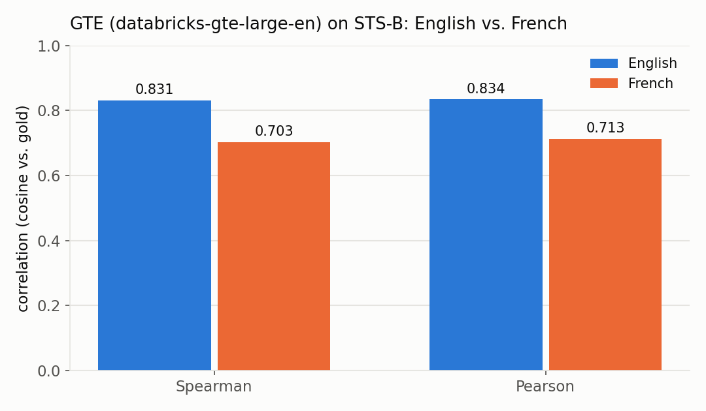
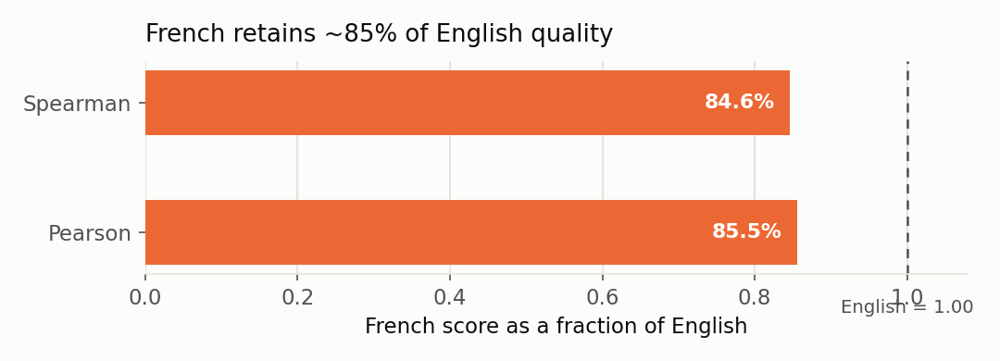

# GTE embeddings — French vs. English benchmark

How much embedding quality does the English-tuned GTE model
(**`databricks-gte-large-en`**, served via the Databricks Foundation Model API) lose on
**French** relative to **English**?

The benchmark runs the [STS Benchmark](https://huggingface.co/datasets/PhilipMay/stsb_multi_mt)
in parallel on both languages — the *same* 1,379 sentence pairs with *identical* gold
similarity scores — and measures the Spearman correlation between cosine similarity and the
gold score (`cosine_spearman`, MTEB's standard STS metric). Because the pairs and labels are
identical across languages, any gap is attributable to language alone.

## Results

| Language | Pairs | cosine_spearman | cosine_pearson |
|----------|------:|----------------:|---------------:|
| English  | 1,379 | **0.8310** | 0.8338 |
| French   | 1,379 | **0.7032** | 0.7133 |

**FR/EN Spearman ratio: 0.846** — French retains ~85% of English quality.

### Verdict

The English score (0.831) matches GTE-large-en's published STS-B result, which validates the
harness. French comes in at 0.703 — a solid correlation, so the endpoint is **usable for
French**, but with a **~15% relative quality drop** vs. English. For French-heavy
retrieval/search where precision matters, weigh this gap against a French-capable or
multilingual embedding model.

## Running it

`benchmark_gte_french.ipynb` runs on **serverless** compute and queries the FMAPI endpoint
only (no local model). On first run it downloads STS-B from HuggingFace into a UC Volume and
caches it; subsequent runs read the cached parquet and skip the download.

- **Endpoint:** `databricks-gte-large-en`
- **Cache + results:** `/Volumes/<catalog>/<schema>/<volume>/` (edit the `CATALOG`/`SCHEMA`
  config cell). Results are written to `results_gte_french.csv` there.
- **Charts:** the notebook's final cell regenerates the two charts below from `results` and
  writes them to the same Volume. The images in [`assets/`](assets/) are copied from there,
  so they stay reproducible from the run (refresh with
  `databricks fs cp /Volumes/.../sts_en_vs_fr.png assets/ --overwrite`).

## Files

| Path | What |
|------|------|
| [`benchmark_gte_french.ipynb`](benchmark_gte_french.ipynb) | The benchmark notebook |
| [`SPEC/SPECS.md`](SPEC/SPECS.md) | Full specification (dataset, metric, method) |
| [`SPEC/RESULTS.md`](SPEC/RESULTS.md) | Recorded run + verdict |
| [`assets/`](assets/) | Comparison charts |

_Run on 2026-09-15, serverless, workspace `e2-demo-field-eng`._
