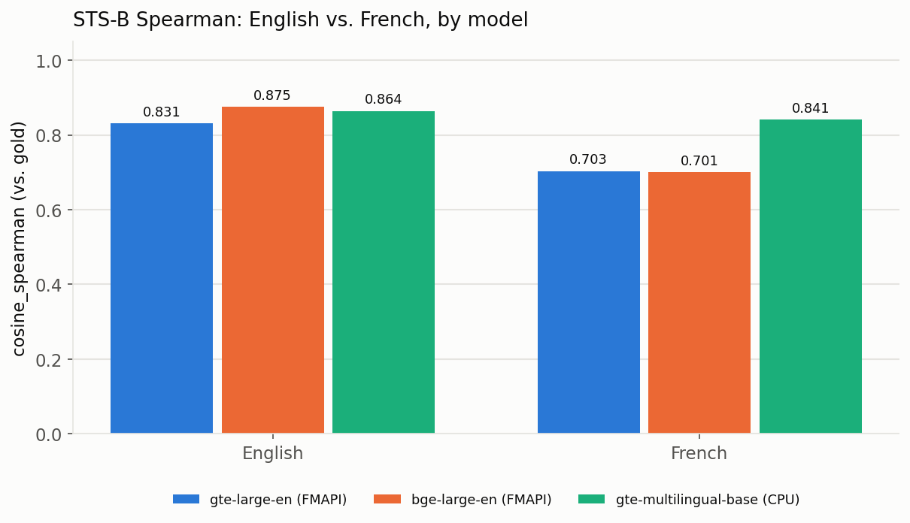
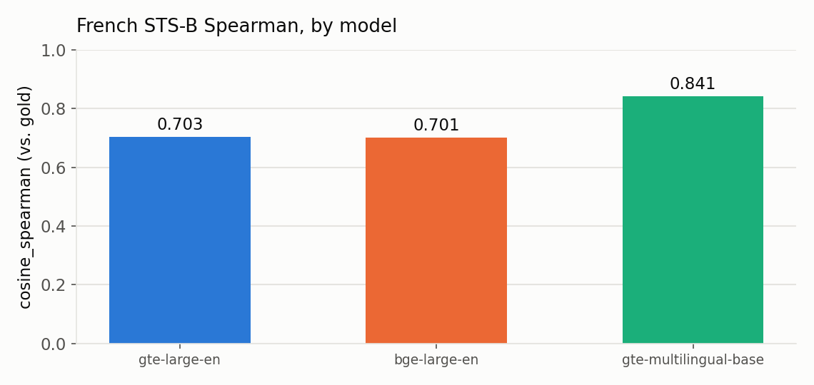

# GTE / BGE embeddings — French vs. English benchmark

How much embedding quality do English-tuned models lose on **French** vs. **English**, and
does a **multilingual** model close that gap? Three models, same pairs and metric:

- **`databricks-gte-large-en`** — Databricks FMAPI endpoint (English-tuned GTE)
- **`databricks-bge-large-en`** — Databricks FMAPI endpoint (English-tuned BGE)
- **`Alibaba-NLP/gte-multilingual-base`** — downloaded from HuggingFace, run locally on CPU

The benchmark runs the [STS Benchmark](https://huggingface.co/datasets/PhilipMay/stsb_multi_mt)
in parallel on both languages — the *same* 1,379 sentence pairs with *identical* gold
similarity scores — and measures the Spearman correlation between cosine similarity and the
gold score (`cosine_spearman`, MTEB's standard STS metric). Because the pairs and labels are
identical across languages, any gap is attributable to language alone.

## Results

| Model | EN `cosine_spearman` | FR `cosine_spearman` | FR/EN ratio |
|-------|---------------------:|---------------------:|------------:|
| `gte-large-en` (FMAPI) | 0.831 | 0.703 | 0.846 |
| `bge-large-en` (FMAPI) | **0.875** | 0.701 | 0.801 |
| `gte-multilingual-base` (CPU) | 0.864 | **0.841** | **0.973** |

### Verdict

Both English-tuned FMAPI endpoints land at **~0.70 on French** despite strong English
scores — `bge-large-en` is actually the best model on English (0.875) but drops the hardest
on French (FR/EN 0.80). So a higher English score does **not** predict French quality.

**`gte-multilingual-base` is the clear choice for French:** French Spearman **0.841**
(+0.14 over either English-only model), an FR/EN ratio of **0.97**. The trade-off is hosting
it yourself (here: downloaded from HuggingFace, run on CPU) rather than a managed FMAPI
endpoint.

## Running it

`benchmark_gte_french.ipynb` runs on **serverless** compute and benchmarks all three models:

- **`gte-large-en`** and **`bge-large-en`** via their FMAPI endpoints (no local model).
- **`gte-multilingual-base`** downloaded from HuggingFace and run locally on CPU via
  `sentence-transformers`. Notes baked into the notebook: pin `transformers>=4.41,<5` (its
  custom code calls `ModuleUtilsMixin` helpers removed in v5); cache the model in a UC Volume
  via a symlink-dereferenced copy (HF can't download onto a FUSE Volume); load with
  `low_cpu_mem_usage=False` and rebuild the non-persistent `position_ids`/RoPE buffers.

On first run it downloads STS-B and the model into a UC Volume and caches both; later runs
skip the downloads.

- **Cache + results:** `/Volumes/<catalog>/<schema>/<volume>/` (edit the `CATALOG`/`SCHEMA`
  config cell). Results are written to `results_gte_french.csv` there.
- **Charts:** the notebook's final cell regenerates the two charts above from `results` and
  writes them to the same Volume. The images in [`assets/`](assets/) are copied from there,
  so they stay reproducible from the run (refresh with
  `databricks fs cp /Volumes/.../sts_by_model.png assets/ --overwrite`).
- **`test_multilingual_load.ipynb`** is a standalone diagnostic that isolates the
  multilingual model load on CPU.

## Files

| Path | What |
|------|------|
| [`benchmark_gte_french.ipynb`](benchmark_gte_french.ipynb) | The three-model benchmark notebook |
| [`test_multilingual_load.ipynb`](test_multilingual_load.ipynb) | Diagnostic: load the multilingual model on CPU |
| [`SPEC/SPECS.md`](SPEC/SPECS.md) | Full specification (dataset, metric, method) |
| [`SPEC/RESULTS.md`](SPEC/RESULTS.md) | Recorded run + verdict |
| [`assets/`](assets/) | Comparison charts |

_Run on 2026-09-15, serverless, workspace `e2-demo-field-eng`._
